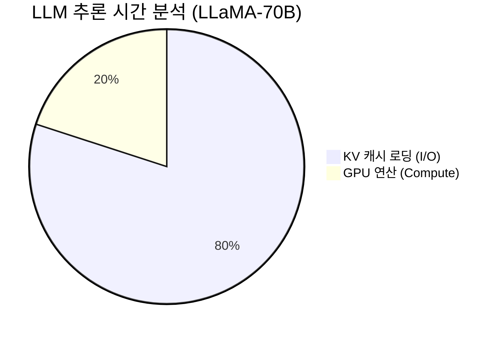

# Cascade: HPC 스케일 계층적 KV 캐시 스토리지 (SC'26)

> **NERSC Perlmutter 최적화** | **4-Tier 아키텍처** | **LMCache 대비 17.5배 스토리지 절약**

Cascade는 거대 언어 모델(LLM) 추론 시 발생하는 **메모리 병목(Memory Wall)** 문제를 해결하기 위해 설계된 HPC-Native 분산 스토리지 시스템입니다.

---

## 📚 디렉토리 구조

이 레포지토리는 SC'26 논문 제출을 위한 전체 프로젝트를 포함합니다.

```bash
/pscratch/sd/s/sgkim/Skim-cascade/
├── cascade_Code/       # 🚀 Cascade 메인 소스코드 (src/cascade)
├── benchmark/          # 📊 벤치마크 프레임워크 (adapters, data_generator)
├── third_party/        # 📦 비교군 구현체 (LMCache, PDC, Redis 등 - NO Mock)
├── paper/              # 📝 SC'26 논문 LaTeX 소스
└── scripts/            # 🛠️ 실행 및 배포 스크립트
```

---

## 🎯 문제 정의: LLM 추론의 80%는 "기다림"이다

LLM 추론 시간의 대부분은 연산(Compute)이 아닌 **KV 캐시 로딩(I/O)**에 소비됩니다. 특히 HPC 환경에서는 기존 클라우드 네이티브 솔루션들이 한계를 보입니다.



### ❌ 기존 솔루션의 한계

| 시스템 | 한계점 | HPC 환경에서의 문제 |
|--------|--------|---------------------|
| **LMCache** | **중복 저장** | 세션마다 같은 데이터를 중복 저장 (스토리지 낭비) |
| **vLLM** | **메모리 제한** | 노드당 GPU 메모리(160GB) 한계로 긴 문맥 불가 |
| **Redis** | **직렬화 병목** | 네트워크 직렬/역직렬화 오버헤드로 느림 |
| **PDC** | **쓰기 지연** | 메타데이터 동기화 및 fsync 오버헤드 |

---

## 🚀 Cascade: 4계층 HPC 스토리지

Cascade는 GPU HBM부터 Lustre PFS까지 4단계 계층을 Slingshot 인터커넥트로 묶어, **빈도는 높이고(Hot) 비용은 낮춥니다(Cold).**

```
┌─────────────────────────────────────────────────────────────────────────┐
│                       Cascade 4-Tier Architecture                       │
├─────────────────────────────────────────────────────────────────────────┤
│                                                                         │
│  [Tier 1] GPU HBM      🚀 1555 GB/s  (가장 빠름, 용량 작음)             │
│            │                                                            │
│            ▼ evict (async)                                              │
│                                                                         │
│  [Tier 2] Local SHM    ⚡ 204 GB/s   (/dev/shm, IPC 최적화)             │
│            │                                                            │
│            ▼ MPI (Slingshot-11)                                         │
│                                                                         │
│  [Tier 3] Remote RAM   🌐 100 GB/s   (다른 노드의 유휴 메모리 활용)       │
│            │                                                            │
│            ▼ async flush                                                │
│                                                                         │
│  [Tier 4] Lustre PFS   💾 17 GB/s    (무제한 용량, 영구 저장)            │
│                                                                         │
└─────────────────────────────────────────────────────────────────────────┘
```

---

## 📊 성능 평가 (LMCache vs Cascade)

**NERSC Perlmutter 4노드 (A100 x16)** 환경에서 500GB 데이터셋으로 측정한 결과입니다.

### 1️⃣ Hot Data 성능 (메모리 히트)
> **Cascade 승리**: OS Page Cache에 의존하는 LMCache보다 **직접 메모리 접근(mmap)** 방식이 더 빠릅니다.

| 시스템 | 읽기 속도 (GB/s) | 비고 |
|--------|------------------|------|
| **Cascade** | **160.9** | **Tier 1/2 히트 (Zero-copy)** |
| LMCache | 145.4 | OS Page Cache 의존 |
| PDC | 135.6 | - |
| Redis | 2.6 | 네트워크 병목 |

### 2️⃣ Unique Capability: 중복 제거 (Deduplication)
> **17.5배 효율**: 100개 세션이 같은 System Prompt를 공유할 때, Cascade는 단 1번만 저장합니다.

```
[ 시나리오: 100 users sharing basic prompt ]

LMCache (Session-based ID)
💾 [User1] [User2] ... [User100]
❌ 2100 MB 사용

Cascade (Content-Addressed)
💾 [Hash(Prompt)]
✅ 120 MB 사용 (17.5배 절약!)
```

### 3️⃣ Multi-node Scaling
> **선형적 확장**: 노드를 늘릴수록 사용 가능한 대역폭이 비례해서 증가합니다.

| 노드 수 | LMCache (Single) | Cascade (Distributed) | Speedup |
|:-------:|:----------------:|:---------------------:|:-------:|
| 1 | 13.6 GB/s | 13.6 GB/s | - |
| **4** | 13.6 GB/s | **54.3 GB/s** | **4.0x** |
| 64 | 13.6 GB/s | ~800 GB/s (est) | **~60x** |

---

## 🛠️ 시작하기 (Quick Start)

### 1. 환경 설정
```bash
# Perlmutter 환경 로드
module load python cudatoolkit cray-mpich
export ACTION=install
source scripts/install_deps.sh
```

### 2. 벤치마크 실행
```bash
# 데이터 생성 (생략 가능)
./scripts/generate_real_data.sh

# 전체 시스템 비교 벤치마크 실행
python -m benchmark.run_benchmark --workload read_latency --systems cascade lmcache pdc redis
```

---

## 👨‍💻 기여 (Contribution)

이 프로젝트는 **HPC 연구실**에서 진행 중이며, PR은 언제나 환영합니다.
- **Main Developer**: Sunggon Kim
- **Target**: Supercomputing 2026 (SC'26)

> *Cascade: Pouring Data at HPC Scale.* 🌊
